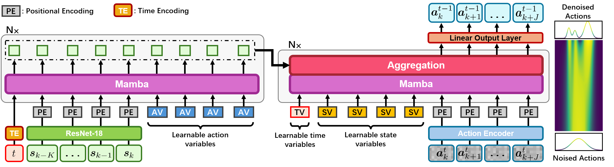
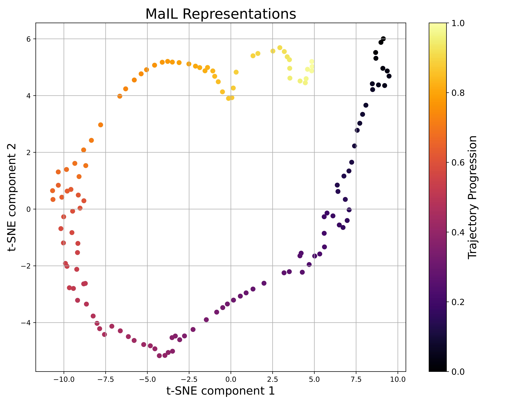
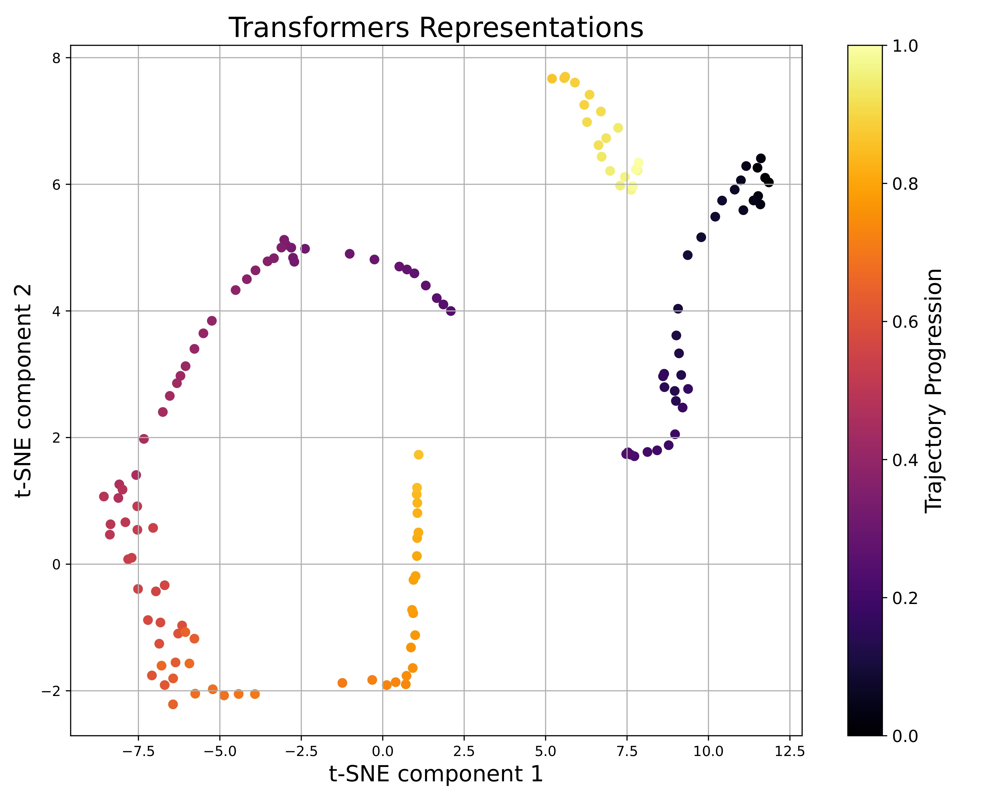

# MaIL

[Paper](https://openreview.net/forum?id=IssXUYvVTg), [Arxiv](https://arxiv.org/abs/2406.08234), [Project Page](https://xiaogangjia.github.io/mail_website/), [CoRL 2024](https://www.corl.org/home)

[Xiaogang Jia*](https://xiaogangjia.github.io/Personal_Website/)<sup>1</sup><sup>2</sup>,
Qian Wang*<sup>1</sup>
Atalay Donat<sup>1</sup>,
Bowen Xing<sup>1</sup>,
Ge LI<sup>1</sup>,
Hongyi Zhou<sup>2</sup>,
Onur Celik<sup>1</sup>,
[Denis Blessing](https://alr.iar.kit.edu/21_495.php)<sup>1</sup>,
[Rudolf Lioutikov](https://rudolf.intuitive-robots.net/)<sup>2</sup>,
[Gerhard Neumann](https://alr.iar.kit.edu/21_65.php)<sup>1</sup>

<sup>1</sup>Autonomous Learning Robots, Karlsruhe Institute of Technology

<sup>2</sup>Intuitive Robots Lab, Karlsruhe Institute of Technology

\* indicates equal contribution

<p align="center">

  

</p>

<p align="center">

  
  

</p>

This project encompasses the MaIL codebase, which includes the implementation of the Decoder-only Mamba and Encoder-Decoder Mamba
for BC and DDPM models. Highlights of MaIL:
- MaIL achieves better results compared to Transformer-based models on the LIBERO benchmark with 20% data.
- MaIL can be used as a standalone policy or as a part of advanced methods like diffusion.
- MaIL has a much more structured latent space compared to Transformer-based models.
## Installation
To begin, clone this repository locally
```
git clone git@github.com:ALRhub/MaIL.git
```

### Installing requirements
```
conda create -n mail python=3.8
conda activate mail

# adapt to your own cuda version if you need
pip install torch torchvision torchaudio --index-url https://download.pytorch.org/whl/cu118

pip install -r requirements.txt
```

### Installing LIBERO Setup
```
git clone https://github.com/Lifelong-Robot-Learning/LIBERO.git
cd LIBERO
pip install -e .
```
### Installing Mamba
```
pip install mamba-ssm==1.2.0.post1
```

## Usage

### File System
```
MaIL
└── agents # model implementation
    └── models
    ...
└── configs # task configs and model hyper parameters
└── environments
        ...
    └── dataset # data saving folder and data process
        └── data
        ...
└── scripts # running scripts and hyper parameters
    └── aligning
    └── stacking
    ...
└── task_embeddings # language embeddings
└── simulation # task simulation
...
```

### Reproduce the results
Train decoder-only mamba with `BC` on LIBERO-Spatial and LIBERO-Object tasks using 3 seeds
```
bash scripts/bc/libero_so_bc_mamba.sh
```

Train encoder-decoder mamba with `DDPM` on LIBERO-Spatial and LIBERO-Object tasks using 3 seeds
```
bash scripts/3seed/libero_so_mamba.sh
```

### Acknowledgements

The code of this repository relies on the following existing codebases:
- [Mamba] https://github.com/state-spaces/mamba
- [D3Il] https://github.com/ALRhub/d3il
- [LIBERO] https://github.com/Lifelong-Robot-Learning/LIBERO

### Citation
If you found the code usefull, please cite our work:

```
@inproceedings{
jia2024mail,
title={Ma{IL}: Improving Imitation Learning with Selective State Space Models},
author={Xiaogang Jia and Qian Wang and Atalay Donat and Bowen Xing and Ge Li and Hongyi Zhou and Onur Celik and Denis Blessing and Rudolf Lioutikov and Gerhard Neumann},
booktitle={8th Annual Conference on Robot Learning},
year={2024},
url={https://openreview.net/forum?id=IssXUYvVTg}
}
```